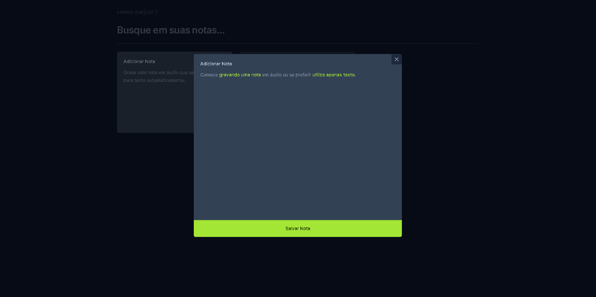

<h1 align="center">NLW Expert Notes</h1>

<h3 align="center">
  Vamos criar notas!
</h3>

## 🏠 About the project

Participei do evento da RocketSeat, junto com o professor Diego Fernandes que me ensinou várias coisas.

Desenvolvimento de uma aplicação front-end em ReactJS, aplicação dos conceitos de Propriedades, Estados e Componentes, tipagem com Typescript, tooling com Vite, interface responsiva com TailwindCSS, uso de APIs da Web como Web Storage e Web Speech.
 

## 🖥️ Technologies

[TypeScript]  
[React]  
[TailWindCSS]  
[Vite]  
[WebSpeech]  
[WebStorage]  

## Run Project in you Navigator

https://nlw-expert-notes-ndwt.vercel.app

## Contributors

We thank the following people who contributed to this project:

<table>
  <tr>
    <td align="center">
      <a href="#">
         
        
          <b>Luan Rebuli</b>
        
      </a>
    </td>
  </tr>

## Certificates
  https://app.rocketseat.com.br/certificates/3d261164-b7f5-4773-8414-72b172ad6f3c
</table>

